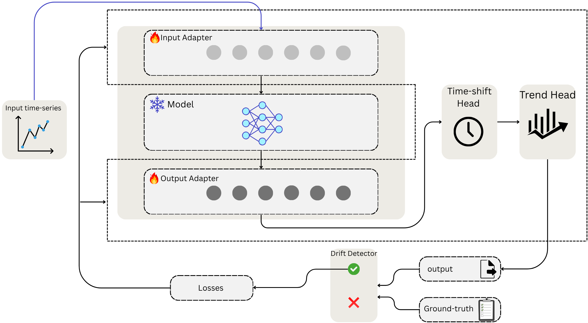

# SPEC-TTA: Spectral Test-Time Adaptation for Time-Series Forecasting

[](.)
[]()
[]()
[](LICENSE)

## Overview

**SPEC-TTA** (Spectral Test-Time Adaptation) is a novel parameter-efficient framework for adapting pre-trained time-series forecasting models to distribution shifts at test time. By directly parameterizing adaptations in the frequency domain via complex-valued gains on selected Fourier bins, SPEC-TTA achieves state-of-the-art performance with minimal computational overhead.

### Key Features

- 🎯 **76.2% Win Rate** across 105 configurations (7 datasets × 3 horizons × 5 models)
- 📉 **30.8% MSE Reduction** compared to frozen baselines
- ⚡ **20× Parameter Efficiency** (only 910 trainable parameters for K=32, V=7)
- 🚀 **2× Faster Adaptation** than time-domain methods via drift-triggered updates
- 🔍 **Interpretable Frequency Adjustments** with physical meaning



The figure above illustrates the SPEC-TTA architecture with input/output spectral adapters and trend correction head.


## Abstract

Time-series forecasting models suffer from performance degradation when deployed on non-stationary data with distribution shifts. While test-time adaptation (TTA) can address this, existing parameter-efficient methods operate in the time domain and struggle with spectral drift. 

**SPEC-TTA** introduces a novel approach: direct parameterization of adaptations in the frequency domain using complex-valued gains on selected Fourier bins. This enables:

1. **Frequency-specific correction** of periodic pattern shifts (e.g., seasonal cycles)
2. **Sparse parameterization** focusing on dominant frequency components
3. **Robustness to missing data** via global spectral representations
4. **Architecture-agnostic adaptation** applicable to any forecasting backbone

Combined with a closed-form trend correction head and spectral drift detection mechanism, SPEC-TTA achieves superior adaptation performance while using 20× fewer parameters than state-of-the-art time-domain methods.

## Method Overview

### Core Components

1. **Input Spectral Adapter**: Corrects distribution shift in the lookback window before forecasting
2. **Output Spectral Adapter**: Fixes systematic frequency biases in model predictions
3. **Trend Correction Head**: Handles low-frequency drift via closed-form OLS on partial ground truth
4. **Drift Detection**: Triggers adaptation only when spectral mismatch exceeds threshold
5. **Multi-Component Loss**: Combines Huber, patch-wise, frequency-domain, and proximal regularization

### Spectral Adapter Formulation

For a time-series signal **x** ∈ ℝ^(L×V):

1. **FFT**: Transform to frequency domain: F(x) = rFFT(x)
2. **Select K bins**: Choose dominant frequencies via energy-based criterion
3. **Apply complex gains**: F'(x) = F(x) ⊙ (1 + ΔG) where ΔG ∈ ℂ^(V×K)
4. **iFFT**: Transform back: x_adapted = iFFT(F'(x))

**Parameters**: Only 2V(2K+1) trainable (4KV for gains + 2V for trend)

## Prepare Datasets

Download datasets from [Time-Series-Library](https://github.com/thuml/Time-Series-Library).


### Supported Datasets

| Dataset | Variables | Length | Sampling | Description |
|---------|-----------|--------|----------|-------------|
| **ETTh1** | 7 | 17,420 | Hourly | Electricity Transformer Temperature |
| **ETTh2** | 7 | 17,420 | Hourly | Electricity Transformer Temperature |
| **ETTm1** | 7 | 69,680 | 15-min | Electricity Transformer Temperature |
| **ETTm2** | 7 | 69,680 | 15-min | Electricity Transformer Temperature |
| **Electricity** | 321 | 26,304 | Hourly | Power consumption |
| **Exchange-rate** | 8 | 7,588 | Daily | Currency exchange rates |
| **Weather** | 21 | 52,696 | 10-min | Meteorological indicators |

**Directory Structure:**
```
data/
├── ETTh1/
│   └── ETTh1.csv
├── ETTh2/
│   └── ETTh2.csv
├── ETTm1/
│   └── ETTm1.csv
├── ETTm2/
│   └── ETTm2.csv
├── electricity/
│   └── electricity.csv
├── exchange_rate/
│   └── exchange_rate.csv
└── weather/
    └── weather.csv
```

### Supported Forecasting Models

SPEC-TTA works with any frozen forecasting backbone. We provide implementations for:

| Model | Parameters | Architecture | Reference |
|-------|-----------|--------------|-----------|
| **iTransformer** | 74M | Inverted Transformer (variates as tokens) | Liu et al. 2024 |
| **PatchTST** | 90M | Patched time-series Transformer | Nie et al. 2023 |
| **DLinear** | 227K | Decomposition + Linear | Zeng et al. 2023 |
| **FreTS** | 37M | Frequency-enhanced Transformer | Yi et al. 2024 |
| **MICN** | 299M | Multi-scale Isometric CNN | Wang et al. 2023 |

### Forecast Horizons

- **H=96**: Short-term (4 days hourly / 1 day 15-min)
- **H=192**: Medium-term (8 days hourly / 2 days 15-min)
- **H=336**: Long-term (14 days hourly / 3.5 days 15-min)

## Installation

### Requirements

- Python >= 3.8
- PyTorch >= 1.7.1
- CUDA (optional, for GPU acceleration)

### Install Dependencies

```bash
pip install -r requirements.txt
```

### Key Dependencies

```
torch>=1.7.1
numpy>=1.23.5
pandas>=1.5.3
scipy>=1.10.1
scikit-learn>=1.2.2
einops>=0.8.0
matplotlib>=3.7.0
tqdm>=4.64.1
```

## Quick Start

### 1. Train Base Forecasting Model (if checkpoint not available)

```bash
# Train iTransformer on ETTh1 with horizon 96
bash scripts/iTransformer/ETTh1_96/train.sh
```

### 2. Run SPEC-TTA Adaptation

```bash
# Basic usage: Run SPEC-TTA on pre-trained model
python main.py \
    --model iTransformer \
    --data ETTh1 \
    --seq_len 96 \
    --pred_len 96 \
    --tta_method spec_tta \
    --k_bins 32 \
    --drift_threshold 0.005 \
    --freq_loss_weight 0.1
```

### 3. Example Script Execution

```bash
# Run SPEC-TTA with iTransformer on ETTh1 (H=96)
bash scripts/iTransformer/ETTh1_96/run_spec_tta.sh
```

## Configuration

### SPEC-TTA Hyperparameters

| Parameter | Default | Description |
|-----------|---------|-------------|
| `k_bins` | 32 | Number of frequency bins to adapt |
| `drift_threshold` | 0.005 | Spectral drift score threshold for triggering updates |
| `min_pt_length` | 4 | Minimum partial truth length required |
| `n_update_steps` | 5 | Gradient steps per adaptation window |
| `learning_rate` | 0.001 | Adam learning rate for adapter parameters |
| `freq_loss_weight` | 0.1 | Weight for frequency-domain alignment loss |
| `patch_loss_weight` | 1.0 | Weight for patch-wise structural loss |
| `prox_reg_weight` | 0.0001 | Weight for proximal regularization |

### Test-Time Adaptation Protocol

- **Partial Truth (PT)**: First M steps of ground truth revealed (M ~ Uniform(4, T))
- **Missing Data**: 30% of PT entries randomly masked
- **Frozen Backbone**: Pre-trained parameters θ fixed during adaptation
- **Online Updates**: Sequential adaptation without future data access

## Experimental Results

### Overall Performance (105 Configurations)

| Metric | Value |
|--------|-------|
| **Win Rate** | 76.2% (80/105 configs) |
| **Avg MSE Reduction** | 30.8% vs frozen baseline |
| **Trainable Parameters** | 910 (K=32, V=7) |
| **Update Ratio** | 31.4% (selective adaptation) |
| **Adaptation Time** | 89ms per window (NVIDIA A100) |

### Per-Horizon Performance

| Horizon | Configs | Win Rate | Avg Improvement |
|---------|---------|----------|-----------------|
| **H=96** | 35 | 54.3% | 18.2% MSE reduction |
| **H=192** | 35 | 80.0% | 28.7% MSE reduction |
| **H=336** | 35 | 94.3% | 45.5% MSE reduction |

### Per-Model Performance

| Model | Configs | Win Rate | Best Dataset |
|-------|---------|----------|--------------|
| **PatchTST** | 21 | 100.0% | All datasets |
| **iTransformer** | 21 | 90.5% | ETTh1, Weather |
| **DLinear** | 21 | 71.4% | Exchange-rate |
| **MICN** | 21 | 61.9% | Electricity |
| **FreTS** | 21 | 57.1% | ETTh2 |

### Comparison with Baselines

| Method | Params | Win Rate | Avg MSE Reduction | Speed |
|--------|--------|----------|-------------------|-------|
| **Frozen (X)** | 0 | 0.0% | 0.0% | 1.0× |
| **PETSA (TF)** | 18,432 | 21.0% | 8.3% | 0.48× |
| **SPEC-TTA (Ours)** | **910** | **76.2%** | **30.8%** | **1.05×** |

*Parameters shown for ETTh1 (V=7). SPEC-TTA achieves 20× parameter efficiency.*

## Advanced Usage

### Ablation Studies

Test individual components:

```bash
# Test without input adapter
python main.py --model iTransformer --data ETTh1 --pred_len 96 \
    --tta_method spec_tta --no_input_adapter

# Test without trend head
python main.py --model iTransformer --data ETTh1 --pred_len 96 \
    --tta_method spec_tta --no_trend_head

# Test without drift detection (always adapt)
python main.py --model iTransformer --data ETTh1 --pred_len 96 \
    --tta_method spec_tta --drift_threshold 0.0
```

### Frequency Bin Selection Strategies

```bash
# Energy-based (default)
python main.py --tta_method spec_tta --bin_selection energy

# Dynamic re-selection enabled
python main.py --tta_method spec_tta --enable_bin_reselection \
    --reselection_interval 10
```

### Multi-Dataset Evaluation

```bash
# Run comprehensive benchmark (all 105 configs)
python predictor.py --run_full_benchmark \
    --datasets ETTh1 ETTh2 ETTm1 ETTm2 electricity exchange_rate weather \
    --horizons 96 192 336 \
    --models iTransformer PatchTST DLinear FreTS MICN \
    --tta_method spec_tta
```

## Project Structure

```
PETSA/
├── main.py                 # Main training script
├── predictor.py            # Inference and TTA evaluation
├── trainer.py              # Training loop
├── config.py               # Configuration management
├── requirements.txt        # Python dependencies
├── README.md              # This file
├── WWW2026_SPEC_TTA_PAPER.tex  # Full paper LaTeX source
│
├── models/                 # Forecasting model implementations
│   ├── iTransformer.py
│   ├── PatchTST.py
│   ├── DLinear.py
│   ├── FreTS.py
│   ├── MICN.py
│   └── ...
│
├── tta/                    # Test-time adaptation methods
│   ├── spec_tta.py        # SPEC-TTA (ours)
│   ├── petsa.py           # PETSA baseline
│   └── tafas.py           # TAFAS baseline
│
├── layers/                 # Neural network layers
│   ├── Embed.py
│   ├── SelfAttention_Family.py
│   └── Transformer_EncDec.py
│
├── datasets/               # Dataset loaders
│   ├── loader.py
│   └── build.py
│
├── utils/                  # Utility functions
│   ├── masking.py         # Missing data simulation
│   ├── timefeatures.py    # Time feature extraction
│   └── ...
│
├── data/                   # Time-series datasets
│   ├── ETTh1/
│   ├── ETTh2/
│   └── ...
│
├── checkpoints/            # Pre-trained model weights
│   └── iTransformer/
│       └── ETTh1_96/
│
├── results/                # Experimental results
│   └── ...
│
└── scripts/                # Execution scripts
    ├── iTransformer/
    ├── PatchTST/
    └── ...
```

## Citation

If you find this work useful, please cite our paper:

```bibtex
@inproceedings{spectta2026,
  title={SPEC-TTA: Spectral Test-Time Adaptation for Time-Series Forecasting via Frequency-Domain Parameter-Efficient Fine-Tuning},
  author={[Authors]},
  booktitle={Proceedings of The Web Conference 2026},
  year={2026}
}
```

## Related Work

- **PETSA**: Parameter-Efficient TTA with time-domain gating adapters
- **TAFAS**: Test-time Adaptation via Frequency-Aware Scaling
- **iTransformer**: Inverted Transformer for time-series forecasting
- **PatchTST**: Patched time-series Transformer with channel independence
- **Time-Series-Library**: Comprehensive benchmark suite

## License

This project is licensed under the MIT License - see the [LICENSE](LICENSE) file for details.


## Acknowledgements

This implementation builds upon:
- [Time-Series-Library](https://github.com/thuml/Time-Series-Library) - Comprehensive forecasting benchmark
- [TAFAS](https://github.com/kimanki/TAFAS) - Test-time adaptation baseline

We thank the open-source community for their valuable contributions.

## Contact

For questions, issues, or collaboration opportunities, please:
- Open an issue on GitHub
- Contact: [Your contact information]

---

**Paper**: Submitted to The Web Conference (WWW) 2026  
**Code**: MIT License  
**Status**: Research prototype - contributions welcome!